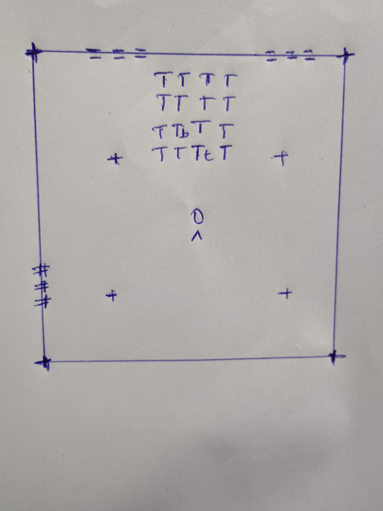

# Chapitre 1, exercice 10 - Le plan de ma salle

Une salle rectangulaire de 5 m sur 4 m, avec un plafond à 2,50 m (la hauteur d'un plafond ordinaire du tableau du chapitre). Toutes les dimensions sont en mètres, et je m'en sers dès le chapitre 7.

## Le plan, vu de dessus

Échelle : 1 caractère = 12,5 cm en largeur (`x`) et 25 cm en profondeur (`z`). Le nord (le mur du fond, `z = -2 m`) est en haut : c'est l'avant du repère du cours (`-z`). L'utilisateur est au centre de la pièce et regarde vers le nord.

Légende :

| Symbole                    | Élément                                                                            |
| -------------------------- | ------------------------------------------------------------------------------------ |
| `=` sur le mur du haut   | les deux fenêtres, dans le mur nord                                                 |
| `#` sur le mur de gauche | la porte, dans le mur ouest                                                          |
| `T`                      | la table                                                                             |
| `b`, `t`, `L`        | ce qui est posé sur la table : le livre, la tasse, la lampe                         |
| `O` et `^`             | l'utilisateur au départ, au centre (origine du repère STAGE), tourné vers le nord |
| `+`                      | les quatre coins de la zone de jeu de 2,50 m sur 2,50 m                              |

Le repère est celui du module : `+x` vers la droite (l'est), `+y` vers le haut, l'avant vers les `z` négatifs (le nord). L'origine est au sol, au centre de la zone de jeu, comme dans l'espace STAGE.

## Les dimensions

**La salle**

| Élément            | Dimensions (m)                       |
| -------------------- | ------------------------------------ |
| Longueur (est-ouest) | 5,00                                 |
| Largeur (nord-sud)   | 4,00                                 |
| Hauteur sous plafond | 2,50                                 |
| Zone de jeu (debout) | 2,50 × 2,50, centrée sur l'origine |

**La porte** (mur ouest) : 0,90 de large × **2,00 de haut**, centrée à `z = +1,00`, donc de `z = 0,55` à `z = 1,45`.

**Les fenêtres** (mur nord), au nombre de deux : chacune 1,20 de large × 1,10 de haut, avec l'appui à 0,90 du sol (le haut de la fenêtre est donc à 2,00). Centres à `x = -1,20` et `x = +1,20`, soit de -1,80 à -0,60 et de 0,60 à 1,80.

**La table** : 1,20 (est-ouest) × 0,60 (nord-sud) × **0,80 de haut**. Posée contre le mur nord, centrée sur `x = 0`, de `z = -1,85` à `z = -1,25` (15 cm de jeu avec le mur). Le plateau est donc à `y = 0,80`, et elle est à 1,25 m de l'origine, à la limite de la zone de jeu, donc atteignable en avançant un peu.

**Ce qui est posé sur la table** (on pose sur le plateau, `y = 0,80`) :

| Objet           | Dimensions (m)             | Position du centre (`x`, `z`) | Haut de l'objet (`y`) |
| --------------- | -------------------------- | --------------------------------- | ----------------------- |
| Livre, à plat  | 0,24 × 0,17 × 0,03       | (-0,30 ; -1,55)                   | 0,83                    |
| Tasse           | ⌀ 0,08, hauteur 0,09      | (0,30 ; -1,50)                    | 0,89                    |
| Lampe de bureau | base ⌀ 0,15, hauteur 0,40 | (0,45 ; -1,70)                    | 1,20                    |

## Vérification par rapport au chapitre

Ces valeurs sont dans les ordres de grandeur du chapitre : porte à 2,00 m, plafond à 2,50 m, table à 0,80 m (l'énoncé), zone de jeu debout de 2 à 3 m de côté. Avec des yeux à 1,60-1,75 m debout, la fenêtre (appui à 0,90 m, haut à 2,00 m) se trouve devant le regard, et la table (0,80 m) est plus basse que l'appui des fenêtres, donc elle ne les cache pas.

Le plan est à l'échelle, dessiné avec des caractères. Si le rendu doit être une feuille à la main, ce plan et ce tableau donnent tout ce qu'il faut pour le reporter sur papier avec les mêmes cotes.
