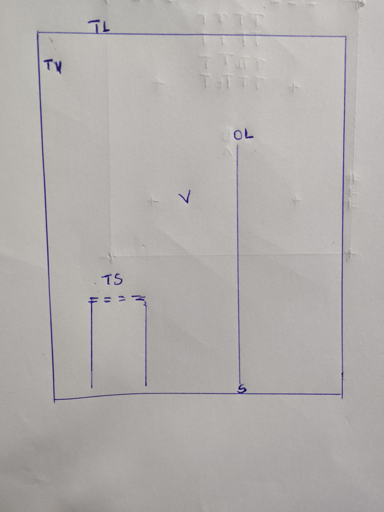

# Chapitre 2, exercice 10 - Les trois espaces, dessinés

Pas de code dans cet exercice. Le dessin ci-dessous est une coupe de la salle vue de côté, à l'échelle : 1 caractère = 5 cm en profondeur (`z`, horizontal) et 10 cm en hauteur (`y`, vertical). Le nord (`z = -2 m`, le mur devant l'utilisateur) est à gauche, l'avant du repère du module (`-z`) va donc vers la gauche. La salle fait 4 m de profondeur et 2,50 m de haut ; c'est celle de l'exercice 10 du chapitre précédent.

## Le dessin

Légende :

| Repère                | Ce que c'est                                                                                                                                                         |
| ---------------------- | -------------------------------------------------------------------------------------------------------------------------------------------------------------------- |
| `O`                  | la tête de l'utilisateur debout, yeux à 1,70 m, au centre de la salle (z = 0), au moment du démarrage                                                             |
| `S`                  | origine de**STAGE** : au sol, au centre de la zone de jeu, à la verticale de l'utilisateur                                                                    |
| `L`                  | origine de**LOCAL** : la pose de la tête **au démarrage**, alignée sur la gravité. Elle est donc à 1,70 m du sol, au même endroit que `O`        |
| `V`                  | origine de**VIEW** : entre les deux yeux, **maintenant**. L'utilisateur s'est penché, elle est à (z = -0,40 ; y = 1,50) et bougera à l'image suivante |
| `=====` avec pieds   | la vraie table de la salle, plateau à 0,80 m du sol (z de -1,85 à -1,25)                                                                                           |
| `TS`, `TL`, `TV` | la « table à 80 cm » posée à y = +0,80 dans STAGE, LOCAL et VIEW (à z = -1,55 dans le repère de chacun)                                                       |

C'est le programme qui choisit dans quel espace il demande les poses au casque, et l'espace choisi fixe l'origine : un espace n'est pas une donnée, c'est un contrat sur l'origine.

## Où se retrouve la table à y = +0,80

| Espace                   | Ce que veut dire « y = +0,80 »                       | Hauteur réelle depuis le sol                                                                    | Ce qu'on voit                                                                                                                                                                                                              |
| ------------------------ | ------------------------------------------------------ | ------------------------------------------------------------------------------------------------ | -------------------------------------------------------------------------------------------------------------------------------------------------------------------------------------------------------------------------- |
| **STAGE** (`TS`) | 0,80 m au-dessus du sol                                | **0,80 m**                                                                                 | La table est à sa place, au niveau de la vraie table.                                                                                                                                                                     |
| **LOCAL** (`TL`) | 0,80 m au-dessus de la tête au démarrage             | 1,70 + 0,80 =**2,50 m** (1,20 + 0,80 = 2,00 m si l'utilisateur était assis au démarrage) | La table flotte au plafond de la salle (2,50 m), et sa hauteur dépend de la posture du démarrage.                                                                                                                        |
| **VIEW** (`TV`)  | 0,80 m au-dessus des yeux, dans le repère de la tête | 1,50 + 0,80 =**2,30 m**, à z = -0,40 - 1,55 = -1,95 m                                     | La table est au plafond, sa moitié arrière sort par le mur du fond (elle occupe z de -2,25 à -1,65 pour 0,60 m de profondeur), et surtout elle**suit la tête** : elle bouge à chaque image, comme un réticule. |

Seul STAGE donne une table à 0,80 m : c'est le seul espace où y = 0 veut dire le plancher, donc le seul où poser un décor a un sens physique.

## Et si on veut une vraie table à 0,80 m du sol ?

Quelle valeur de `y` faut-il écrire dans chaque espace ?

| Espace | Valeur de y                                            | Commentaire                                                                                                                                                       |
| ------ | ------------------------------------------------------ | ----------------------------------------------------------------------------------------------------------------------------------------------------------------- |
| STAGE  | +0,80                                                  | Toujours la même, quoi qu'il arrive.                                                                                                                             |
| LOCAL  | 0,80 - 1,70 =**-0,90**                           | C'est vrai seulement si l'utilisateur avait les yeux à 1,70 m au démarrage. Assis (yeux à 1,20 m), il faudrait -0,40. Le programme ne le sait pas.             |
| VIEW   | 0,80 - y_tête(t),**différent à chaque image** | Aucune constante ne convient, il faudrait recalculer à chaque image en connaissant la pose de la tête dans le monde, c'est-à-dire repasser par un espace fixe. |

Autre lecture possible de « une table à 80 cm » dans LOCAL, celle du cours (« quatre-vingts centimètres sous les yeux ») : y = -0,80. La table serait alors à 1,70 - 0,80 = 0,90 m du sol pour quelqu'un qui était debout, et à 1,20 - 0,80 = 0,40 m pour quelqu'un qui était assis. Dans aucun cas à 0,80 m.

## Ce que je retiens

- **VIEW** pour un réticule ou un affichage qui doit rester devant le regard.
- **LOCAL** pour une expérience assise, où on ne se soucie pas du sol.
- **STAGE** pour la salle : le décor, la table, les murs, tout ce qui est physique.
- Une pose sans dire dans quel espace n'a pas plus de sens qu'une altitude sans dire par rapport à quoi.
