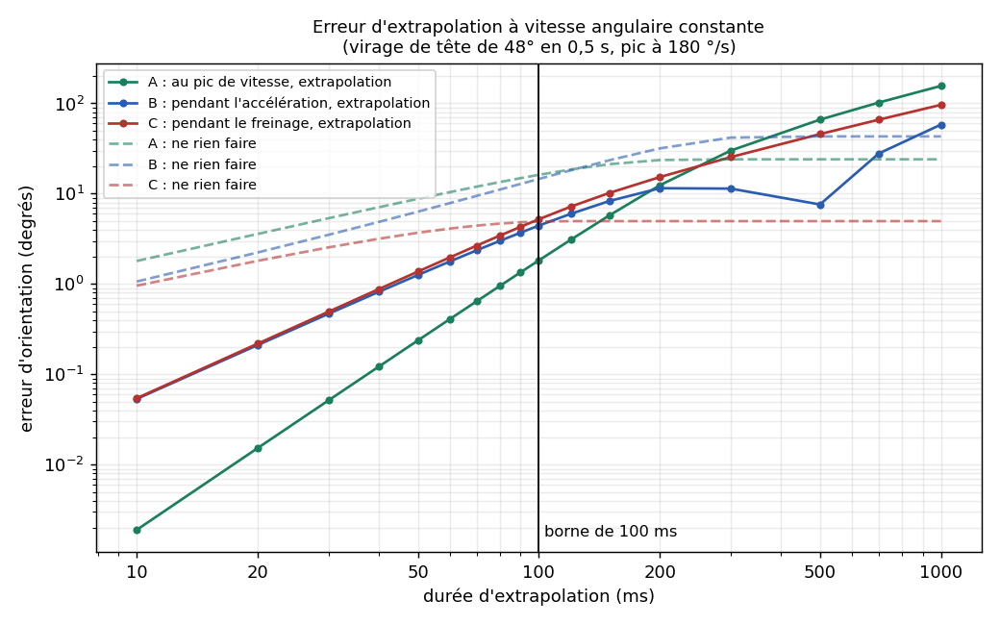

# Chapitre 2, exercice 12 - La borne de cent millisecondes

## La question

Extrapoler à vitesse constante une tête qui tourne, sur des durées de 10 ms à 1 s, comparer à la vraie pose obtenue en simulant le mouvement pas à pas, tracer l'erreur, et dire où la borne de 100 ms se justifie.

## Le piège de l'énoncé

Si la tête tourne vraiment à 180 °/s **de façon constante**, l'extrapolation est exacte et l'erreur est nulle quelle que soit la durée. Je l'ai vérifié (voir plus bas) et ça ne dit rien de la borne. Pour qu'il y ait une erreur, la vraie tête doit changer de vitesse : c'est ce qu'elle fait, car un mouvement de tête commence, atteint un pic, puis s'arrête. J'ai donc simulé un vrai mouvement.

## Le modèle du vrai mouvement

Un virage de tête de **48° en 0,5 s** autour de l'axe vertical, avec la loi de vitesse « jerk minimal » (angle = 48° · (10s³ - 15s⁴ + 6s⁵), avec s = t/0,5). C'est un modèle classique des mouvements volontaires (Flash et Hogan, 1985) et il donne un pic de vitesse de 1,875 × 48 / 0,5 = **180 °/s**. Après 0,5 s la tête est arrêtée. C'est un modèle, pas une mesure sur de vraies têtes.

Le « vrai » mouvement est simulé pas à pas, avec un pas de 0,1 ms : à chaque pas on multiplie l'orientation par la petite rotation faite pendant le pas (vitesse prise au milieu du pas). Le résultat est gardé toutes les millisecondes.

Trois moments d'extrapolation, car l'erreur dépend du moment où on extrapole :

| Cas | Instant t₀ | Vitesse mesurée | Que fait la tête ensuite |
|---|---|---|---|
| **A** | 0,250 s | 180 °/s (le pic) | accélération nulle, elle va ralentir |
| **B** | 0,125 s | 101 °/s | elle accélère encore |
| **C** | 0,375 s | 101 °/s | elle freine, elle s'arrêtera 125 ms plus tard |

L'extrapolation à vitesse constante, elle, ne connaît que la vitesse à t₀ (celle des exercices 8) : `q' = exp(ω · H) · q₀`.

On compare avec un point de référence : ne **rien faire**, c'est-à-dire garder la dernière orientation mesurée sans extrapoler. Extrapoler n'a de sens que si c'est mieux.

## Code

```cpp
// Chapitre 2, exercice 12 : la borne de cent millisecondes.
// On extrapole l'orientation de la tete a vitesse angulaire constante, sur des
// durees de 10 ms a 1 s, et on compare a la "vraie" orientation obtenue en
// simulant le mouvement pas a pas (pas de 0,1 ms).
//
// Le vrai mouvement : un virage de tete de 48 degres en 0,5 s, avec la loi de
// vitesse "jerk minimal" (modele classique des mouvements volontaires). Son pic
// de vitesse vaut 180 degres par seconde. Apres 0,5 s la tete est arretee.
//
// Trois moments d'extrapolation sont testes :
//   A : au pic de vitesse           (t0 = 0,250 s, vitesse 180 deg/s, acceleration nulle)
//   B : pendant l'acceleration      (t0 = 0,125 s, vitesse 101 deg/s)
//   C : pendant le freinage         (t0 = 0,375 s, vitesse 101 deg/s)
//
// Pour chaque duree H on affiche l'erreur (en degres) de l'extrapolation et
// celle du "ne rien faire" (garder la derniere orientation mesuree).
#include <cmath>
#include <cstdio>
#include <vector>

const double PI = 3.14159265358979323846;

struct Vec3 { double x, y, z; };
struct Quat { double x, y, z, w; };

Quat operator*(Quat a, Quat b) {
    return {
        a.w * b.x + a.x * b.w + a.y * b.z - a.z * b.y,
        a.w * b.y - a.x * b.z + a.y * b.w + a.z * b.x,
        a.w * b.z + a.x * b.y - a.y * b.x + a.z * b.w,
        a.w * b.w - a.x * b.x - a.y * b.y - a.z * b.z
    };
}
Quat Conjugue(Quat q) { return { -q.x, -q.y, -q.z, q.w }; }

Quat Normaliser(Quat q) {
    double n = std::sqrt(q.x * q.x + q.y * q.y + q.z * q.z + q.w * q.w);
    return { q.x / n, q.y / n, q.z / n, q.w / n };
}

// Meme fonction que l'exercice 8 : rotation de |omega|*dt autour de omega/|omega|.
Quat Increment(Vec3 omega, double dt) {
    double norme = std::sqrt(omega.x * omega.x + omega.y * omega.y + omega.z * omega.z);
    double angle = norme * dt;
    double k, c;
    if (std::fabs(angle) < 1e-9) { k = 0.5 * dt; c = 1.0; }
    else { k = std::sin(0.5 * angle) / norme; c = std::cos(0.5 * angle); }
    return { omega.x * k, omega.y * k, omega.z * k, c };
}

// Angle (en degres) de la rotation qui separe deux orientations.
double AngleEntre(Quat a, Quat b) {
    Quat d = a * Conjugue(b);
    double s = std::sqrt(d.x * d.x + d.y * d.y + d.z * d.z);
    return 2.0 * std::atan2(s, std::fabs(d.w)) * 180.0 / PI;
}

// ---- Le vrai mouvement (rotation autour de l'axe vertical y) ----
const double AMPLITUDE_DEG = 48.0;
const double DUREE_VIRAGE = 0.5;

double VitesseDegParS(double t) {
    if (t <= 0.0 || t >= DUREE_VIRAGE) return 0.0;
    double s = t / DUREE_VIRAGE;
    return (AMPLITUDE_DEG / DUREE_VIRAGE) * (30.0 * s * s - 60.0 * s * s * s + 30.0 * s * s * s * s);
}

double AngleAnalytiqueDeg(double t) {
    if (t <= 0.0) return 0.0;
    if (t >= DUREE_VIRAGE) return AMPLITUDE_DEG;
    double s = t / DUREE_VIRAGE;
    return AMPLITUDE_DEG * (10.0 * s * s * s - 15.0 * s * s * s * s + 6.0 * s * s * s * s * s);
}

// Simulation pas a pas : on garde l'orientation vraie toutes les millisecondes.
std::vector<Quat> Simuler(double duree_totale) {
    const double pas = 0.0001;              // 0,1 ms
    const int par_ms = 10;                  // 10 pas = 1 ms
    int n_ms = static_cast<int>(duree_totale * 1000.0 + 0.5);
    std::vector<Quat> vraie(n_ms + 1);
    Quat q = { 0.0, 0.0, 0.0, 1.0 };
    vraie[0] = q;
    double t = 0.0;
    for (int ms = 1; ms <= n_ms; ++ms) {
        for (int i = 0; i < par_ms; ++i) {
            double milieu = t + 0.5 * pas;                          // vitesse au milieu du pas
            Vec3 omega = { 0.0, VitesseDegParS(milieu) * PI / 180.0, 0.0 };
            q = Normaliser(Increment(omega, pas) * q);
            t += pas;
        }
        vraie[ms] = q;
    }
    return vraie;
}

// Erreur d'extrapolation et erreur du "ne rien faire", pour un instant t0 (en ms) et une duree H (en ms).
struct Erreurs { double extrapolation, repos; };

Erreurs Mesurer(const std::vector<Quat>& vraie, int t0_ms, int h_ms) {
    Quat q0 = vraie[t0_ms];
    Vec3 omega0 = { 0.0, VitesseDegParS(t0_ms / 1000.0) * PI / 180.0, 0.0 };   // vitesse "mesuree" a t0
    Quat extrapolee = Normaliser(Increment(omega0, h_ms / 1000.0) * q0);
    Quat reelle = vraie[t0_ms + h_ms];
    return { AngleEntre(reelle, extrapolee), AngleEntre(reelle, q0) };
}

int PremierCroisement(const std::vector<Quat>& vraie, int t0_ms) {
    for (int h = 1; t0_ms + h < static_cast<int>(vraie.size()); ++h) {
        Erreurs e = Mesurer(vraie, t0_ms, h);
        if (e.extrapolation > e.repos) return h;
    }
    return -1;
}

int main() {
    std::vector<Quat> vraie = Simuler(1.5);

    // Verification du simulateur : il doit retrouver la formule exacte de l'angle.
    double pire = 0.0;
    for (int ms = 0; ms < static_cast<int>(vraie.size()); ++ms) {
        double simule = 2.0 * std::atan2(vraie[ms].y, vraie[ms].w) * 180.0 / PI;
        pire = std::fmax(pire, std::fabs(simule - AngleAnalytiqueDeg(ms / 1000.0)));
    }
    std::printf("# ecart simulateur / formule exacte : %.2e degres (max sur 1,5 s)\n", pire);

    // Verification de l'extrapolation : a vitesse constante, elle doit etre exacte.
    {
        Quat q = { 0.0, 0.0, 0.0, 1.0 };
        Vec3 omega = { 0.0, 180.0 * PI / 180.0, 0.0 };
        for (int i = 0; i < 10000; ++i) q = Normaliser(Increment(omega, 0.0001) * q);   // 1 s pas a pas
        Quat e = Normaliser(Increment(omega, 1.0) * Quat{ 0.0, 0.0, 0.0, 1.0 });       // 1 s d'un coup
        std::printf("# vitesse constante 180 deg/s, 1 s : erreur = %.2e degres\n", AngleEntre(q, e));
    }

    const int t0[3] = { 250, 125, 375 };
    const int horizons[] = { 10, 20, 30, 40, 50, 60, 70, 80, 90, 100, 120, 150, 200, 300, 500, 700, 1000 };

    std::printf("H_ms,A_extrap,A_repos,B_extrap,B_repos,C_extrap,C_repos\n");
    for (int h : horizons) {
        std::printf("%d", h);
        for (int s = 0; s < 3; ++s) {
            Erreurs e = Mesurer(vraie, t0[s], h);
            std::printf(",%.4f,%.4f", e.extrapolation, e.repos);
        }
        std::printf("\n");
    }

    const char noms[3] = { 'A', 'B', 'C' };
    for (int s = 0; s < 3; ++s) {
        std::printf("# scenario %c : l'extrapolation devient pire que ne rien faire a partir de H = %d ms\n",
                    noms[s], PremierCroisement(vraie, t0[s]));
    }
    return 0;
}
```

Vérifications du programme, avant tout résultat :

```
# ecart simulateur / formule exacte : 4.62e-07 degres (max sur 1,5 s)
# vitesse constante 180 deg/s, 1 s : erreur = 2.74e-13 degres
```

- le simulateur pas à pas retrouve la formule exacte de l'angle à moins de 5 × 10⁻⁷ degré sur 1,5 s ;
- à vitesse constante (180 °/s), l'extrapolation d'une seconde et la simulation pas à pas sont identiques à 3 × 10⁻¹³ degré, donc le code d'extrapolation est juste, et l'erreur des tableaux ci-dessous vient bien de la physique du mouvement.

## Résultats

Erreur d'orientation, en degrés (angle de la rotation qui sépare la pose extrapolée de la vraie pose) :

| durée H (ms) | A : extrapolation (°) | A : ne rien faire (°) | B : extrapolation (°) | B : ne rien faire (°) | C : extrapolation (°) | C : ne rien faire (°) |
|---|---|---|---|---|---|---|
| 10 | 0,002 | 1,80 | 0,053 | 1,07 | 0,054 | 0,958 |
| 20 | 0,015 | 3,58 | 0,211 | 2,24 | 0,219 | 1,81 |
| 30 | 0,052 | 5,35 | 0,469 | 3,51 | 0,494 | 2,54 |
| 40 | 0,122 | 7,08 | 0,820 | 4,87 | 0,879 | 3,17 |
| 50 | 0,237 | 8,76 | 1,26 | 6,32 | 1,37 | 3,69 |
| 60 | 0,408 | 10,4 | 1,77 | 7,85 | 1,97 | 4,11 |
| 70 | 0,643 | 12,0 | 2,36 | 9,45 | 2,66 | 4,43 |
| 80 | 0,953 | 13,4 | 3,00 | 11,1 | 3,44 | 4,66 |
| 90 | 1,35 | 14,9 | 3,70 | 12,8 | 4,29 | 4,82 |
| **100** | **1,83** | **16,2** | **4,44** | **14,6** | **5,21** | **4,91** |
| 120 | 3,09 | 18,5 | 5,98 | 18,1 | 7,18 | 4,97 |
| 150 | 5,78 | 21,2 | 8,31 | 23,5 | 10,2 | 4,97 |
| 200 | 12,4 | 23,6 | 11,5 | 31,7 | 15,3 | 4,97 |
| 300 | 30,0 | 24,0 | 11,4 | 41,8 | 25,4 | 4,97 |
| 500 | 66,0 | 24,0 | 7,59 | 43,0 | 45,7 | 4,97 |
| 700 | 102 | 24,0 | 27,8 | 43,0 | 65,9 | 4,97 |
| 1000 | 156 | 24,0 | 58,2 | 43,0 | 96,3 | 4,97 |

La courbe (échelles logarithmiques). Traits pleins : l'extrapolation. Tirets : ne rien faire.



Les horizons où l'extrapolation devient **pire que ne rien faire** (la première durée, à la milliseconde près, où l'erreur d'extrapolation dépasse celle du repos) :

```
# scenario A : l'extrapolation devient pire que ne rien faire a partir de H = 267 ms
# scenario B : l'extrapolation devient pire que ne rien faire a partir de H = 851 ms
# scenario C : l'extrapolation devient pire que ne rien faire a partir de H = 97 ms
```

## Lecture

**Comment l'erreur grandit.** Dans le cas A, elle passe de 0,002° à 10 ms à 1,83° à 100 ms : 960 fois plus pour une durée 10 fois plus longue, donc en gros comme le cube du temps. À vitesse maximale l'accélération est nulle, et l'erreur ne vient que de la façon dont l'accélération change. Dans les cas B et C elle grandit comme le carré du temps (0,053° à 10 ms, 4,4° et 5,2° à 100 ms) : la tête accélère ou freine et l'extrapolation l'ignore.

**Aux durées qu'on utilise vraiment** (le temps qui sépare la mesure de l'affichage est d'une vingtaine de millisecondes, un peu plus avec une image), l'extrapolation est très utile. À 20 ms l'erreur est de 0,015° (A), 0,21° (B) et 0,22° (C), contre 3,6°, 2,2° et 1,8° si on ne fait rien : de 8 à 230 fois mieux. À 30 ms elle reste sous le demi-degré dans les trois cas (0,05°, 0,47°, 0,49°).

**Là où la borne se justifie.** L'extrapolation devient plus mauvaise que ne rien faire :

- à **97 ms** dans le cas C (la tête freine) : à 100 ms l'erreur est de 5,2° contre 4,9°. L'extrapolation continue à faire tourner la tête à 101 °/s alors qu'elle est en train de s'arrêter ;
- à 267 ms dans le cas A et à 851 ms dans le cas B, donc bien plus tard.

La borne de cent millisecondes tombe donc pile là où, dans le pire de mes trois cas, on passe de « l'extrapolation aide » à « l'extrapolation ment plus qu'elle n'aide ». Elle est prudente pour A et B, juste pour C. Et l'erreur y est déjà de plusieurs degrés (1,8° à 5,2° à 100 ms), alors qu'à la durée utile de 20 à 30 ms elle est de quelques dixièmes de degré. Au-delà, on ne corrige plus un retard de quelques millisecondes : on invente un mouvement que la tête n'a pas fait. À 500 ms l'erreur est de 66° dans le cas A alors qu'il ne reste que 24° de virage à la tête : l'extrapolation fait tourner la tête bien au-delà de l'endroit où elle s'est arrêtée.

Un mouvement de tête entier dure ici 0,5 s. Cent millisecondes en font un cinquième : sur cette échelle le modèle « la vitesse ne change pas » n'est plus crédible.

## Limites

- Un seul mouvement modélisé (48° en 0,5 s autour d'un seul axe) et trois instants : une tête réelle change de direction, tourne autour de plusieurs axes, s'arrête plus ou moins brusquement. Les chiffres donnent un ordre de grandeur, pas une loi.
- Je compare des orientations, pas ce qu'on voit à l'écran : une erreur de 1° n'a pas le même aspect selon la résolution angulaire du casque.
- Les vrais runtimes fusionnent plusieurs capteurs et bornent eux aussi l'extrapolation, mais ce programme n'en simule aucun.

## Source

Flash, T. et Hogan, N. (1985), « The coordination of arm movements: an experimentally confirmed mathematical model », *Journal of Neuroscience* 5(7), pp. 1688-1703, pour la loi de vitesse à jerk minimal (utilisée ici pour un mouvement de tête par analogie, ce que je n'ai pas vérifié pour la tête).
